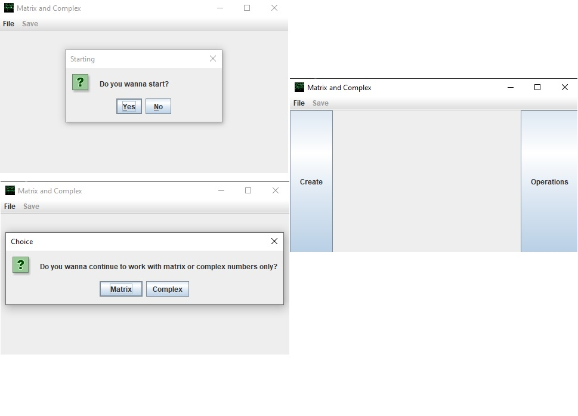
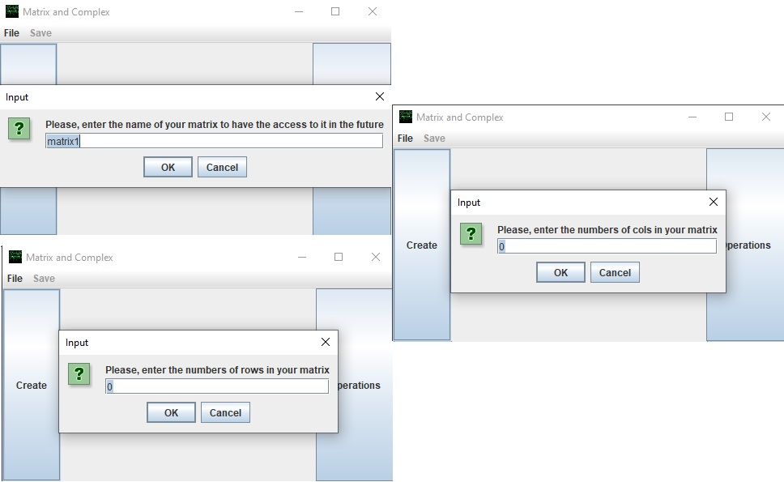
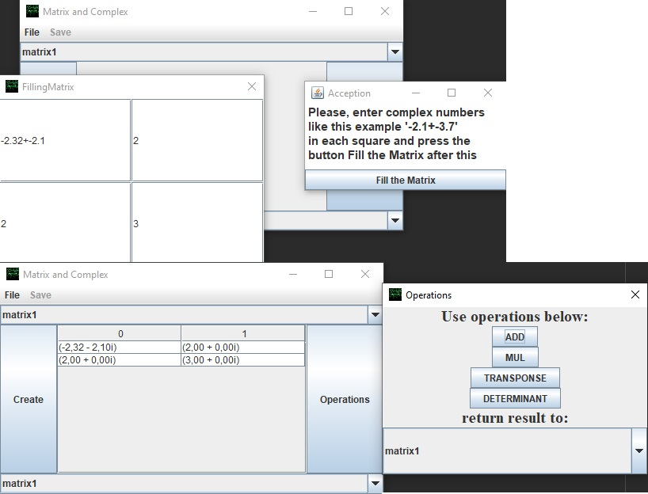

# Implementation of matrix classes with support for complex numbers and basicoperations on them with GUI JAVA SWING.
All methods and fields are documented according to the Javadoc standard.
It is possible to work with matrices using
the real or complex type.

## Table of contents

0. [Main Features](#Main-features)
1. [Code Examples Complex Class](#Code-Examples-Complex-Class)
2. [Code Examples Matrix Class](#Code-Examples-Matrix-Class)
3. [Images](#Images)

## Main Features
____
- Complex class,supported operations
    - Create an object with certain values
    -  Create an object from another class object
    -  Perform chain operations of multiplication, addition, subtraction, division
    -  Create a new class object using the operations above
    -  Get formatted console output in algebraic and trigonometric form
    -  Find the module and the argument
____
- Matrix class,supported operations
    - Create an object with certain values
    -  Create an object from another class object
    -  Perform chain addition operations
    -  Create a new class object using addition, multiplication, and transpose operations
    -  Find the determinant
____
[:arrow_up:Оглавление](#Оглавление)

## Code Examples Complex Class
Constructors of the class of complex numbers `Complex`:
```Java
public class Complex {
    
    Complex(double real, double imag) {
        this.real_part = real;
        this.imag_part = imag;
    }
    Complex(double real)
    {
        this(real,0.0);
    }
    Complex()
    {
        this(0.0,0.0);
    }
    Complex(Complex other)
    {
        this(other.real_part, other.imag_part);
    }
}
```
____
Chained-the add method of the class `Complex`:
```Java
public class Complex {
    
    public Complex add(Complex other)
    {
        this.real_part += other.real_part;
        this.imag_part += other.imag_part;
        return this;
    }
}
```
____
Methods for finding the module and class argument `Complex`:
```Java
public class Complex {
    
    public double mod()
    {
        return Math.sqrt(real_part*real_part + imag_part*imag_part);
    }
    public double arg()
    {
        return Math.atan(imag_part/real_part);
    }
}
```
____
Methods of formatted class output `Complex`:
```Java
public class Complex {
   
    public String inTrigonometric()
    {
        return String.format("In trigonometric = %.4f * (cos(%.4f) + i*sin(%.4f))",
                mod(),arg(), arg());
    }
}
```
____
[:arrow_up:Оглавление](#Оглавление)
____
## Code Examples Matrix Class
Constructors of the class of matrix `Matrix`:
```Java
public class Matrix {

  Matrix()
  {
    matrix = new Complex[0][0];
  }
  
  Matrix(int n)
  {
    this(n,n);

  }
 
  Matrix(int n, int m)
  {
    this.row = n;
    this.col = m;

    matrix = new Complex[row][col];
  }
  
  Matrix(Matrix other)
  {
    this(other.row, other.col);
    for (int i = 0; i < other.row; ++i)
    {
      for (int j = 0; j < other.col; ++j)
      {
        this.matrix[i][j] = new Complex(other.matrix[i][j]);
      }
    }

  }
}
```
____
The add method of the class `Matrix`:
```Java
public class Matrix {

  public Matrix plus(Matrix other)
  {
    if ((this.col == other.col) && (this.row == other.row))
    {
      Matrix result = new Matrix(this.row,this.col);
      for (int i = 0; i < this.row; ++i)
      {
        for (int j = 0; j < this.col; ++j)
        {
          result.matrix[i][j] = this.matrix[i][j].plus(other.matrix[i][j]);
        }
      }
      return result;
    }
    return null;
  }
}
```
____
The multiply method of class `Matrix`:
```Java
public class Matrix {

  public Matrix mul(Matrix other)
  {

    if (this.col == other.row)
    {
      Matrix result = new Matrix(this.row, other.col);
      for (int i = 0; i < this.row; ++i)
      {
        for (int j = 0; j < other.col; ++j)
        {
          result.matrix[i][j] = new Complex(0);
          for (int k  = 0; k < this.col; ++k)
          {
            result.matrix[i][j] = result.matrix[i][j].plus(this.matrix[i][k].multiplication(other.matrix[k][j]));
          }
        }
      }
      return result;
    }
    return null;
  }
}
```
____
Method to transpose `Matrix`:
```Java
public class Matrix {

  public Matrix transponse()
  {
    Matrix result = new Matrix(col, row);
    for (int i = 0; i < row; ++i)
    {
      for (int j = 0; j < col; ++j)
      {
        result.matrix[j][i] = matrix[i][j];
      }
    }
    return result;
  }
}
```
____
____
Method to find the determinant `Matrix`:
```Java
public class Matrix {

  public Complex determinant()
  {
    Complex result = new Complex();
    if (this.row == this.col && this.col > 0)
    {
      if (this.col == 1)
      {
        return this.matrix[0][0];
      }
      else if (this.col == 2)
      {
        return (this.matrix[0][0].multiplication(this.matrix[1][1])).
                minus(this.matrix[0][1].multiplication(this.matrix[1][0]));
      }
      else {
        Matrix tempObj = new Matrix(this.row - 1);
        for(int i = 0; i < this.col; ++i)
        {
          int r = 0;
          int c = 0;

          for(int j = 1; j < this.row; ++j)
          {
            for( int k=0; k< this.col; ++k)
            {
              if (k == i)
              {
                continue;
              }
              tempObj.matrix[r][c++] = this.matrix[j][k];


              if(c == this.col - 1)
              {
                ++r;
                c = 0;
              }
            }
          }
          result.add(this.matrix[0][i].multiplication(new Complex(Math.pow(-1,i))).multiplication(tempObj.determinant()));
        }
      }
      return result;
    }
    return null;
  }
}
```
____
## Images
Here's what it looks like
----
Greeting and work window

----
Creating matrices

----
Operations

----